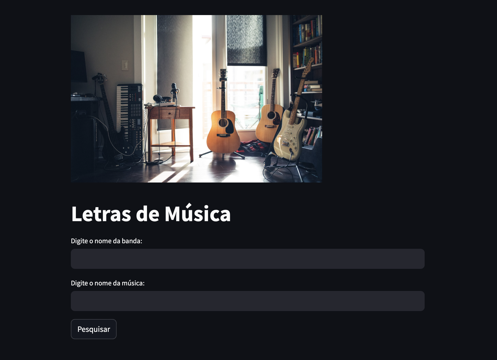

# API de Letras de Música - Streamlit

Este é um projeto desenvolvido com Streamlit que consome uma API GET para buscar a letra de músicas. Basta inserir o nome da banda/artista e o nome da música para obter a letra completa!

## Como acessar

Acesse o projeto online: [Clique aqui](https://api-stremlit.streamlit.app)

### Captura de tela
